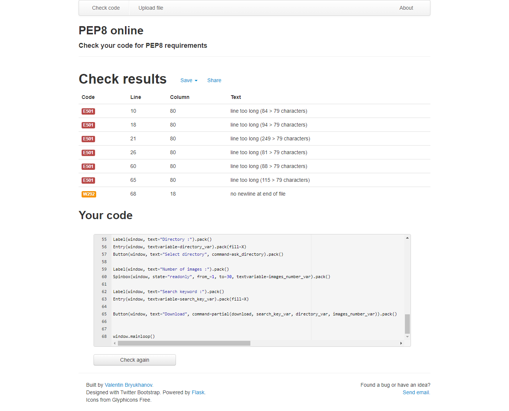
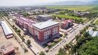
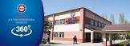

#  Ala Too University Final Project 

  <b>Student: Kurmanbekov Nursultan</b>
  
  <b>Teacher: Ruslan Isaev</b>

First Check project on Pep8 Standard 

Lots of bugs, no big deal, we'll fix it
# So let's take it all step by step

1 Specify the location of your file where you would like to save your downloaded photos

2 Select the number of photos to download
the maximum number of 200 pictures is possible and more if of course you have a quantum computer😂

3 Next, we write the keyword by which Google our big brother will give us pictures on our request.

# Let's Check 
Input Keyword: "Ala Too University"

Result:

***Try it too***
